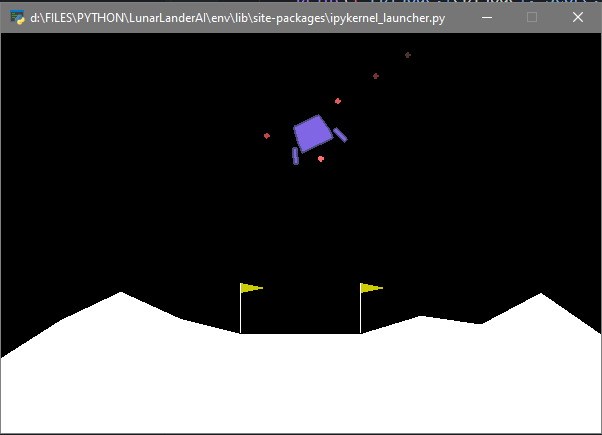

# Lunar Lander AI

## Table of Contents

- [About](#about)
- [Getting Started](#getting_started)

## About 

Reinforcement learning is a machine learning training method based on rewarding desired behaviors and/or punishing undesired ones.

This project has been done following the tutorial on youtube from @NicholasRenotte.

  

## Getting Started 

### Dependencies:

- Stable Baselines: usefull reinforcement learning library having good algorithms. In this project the ACER model was used: https://stable-baselines.readthedocs.io/en/master/modules/acer.html

- Open AI gym: one of the most popular libraries when it comes to reinforcement learning environments. In this project the environment used was "Luna Lander": https://gym.openai.com/envs/LunarLander-v2/

